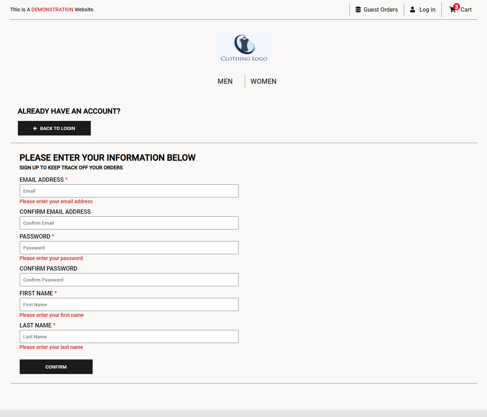

# Clothes store website - In Development

This is a clothing store website where customers are able to browse and purchase clothes. This website was built using the PERN stack.

## Motivation

I decided to start creating a clothing store because I was interested in what goes on behind clothing stores such as Uniqlo and H&M both of which inspired the design of the website.

## Code Style

Prettier

## Screen Shots

### Browsing the Catalogue

### Product Page

### Cart Page

### Login Page

### Register Page

## Tech/Framework/Modules/API's

### Frameworks

-React

-Express

### Tech

-Node.js

-Javascript

-HTML5/CSS3

### Modules

**Client**

- Axios
- React-Router-Dom

**Server**

- cors
- dotenv
- helmet
- morgan
- pg
- jsonwebtoken
- bcrypt
- nodemon

## Features

**Current features:**

-Browse the men's and womens catalogue of clothes

-Sign up with an account that uses bcrypt to hash passwords and jsonweb tokens to check if the user is logged in.

-Log in and view your ten most recent previously submitted orders. 

-Add clothes into the cart from the product page where you can select size and a colour variant.

-View the shopping cart at any time and delete or change quantity of items.

-Fill in shipping and billing information and confirm order.

-View the guest orders page that displays the ten most recent guest orders. So you do not need an account to view a successful order.
