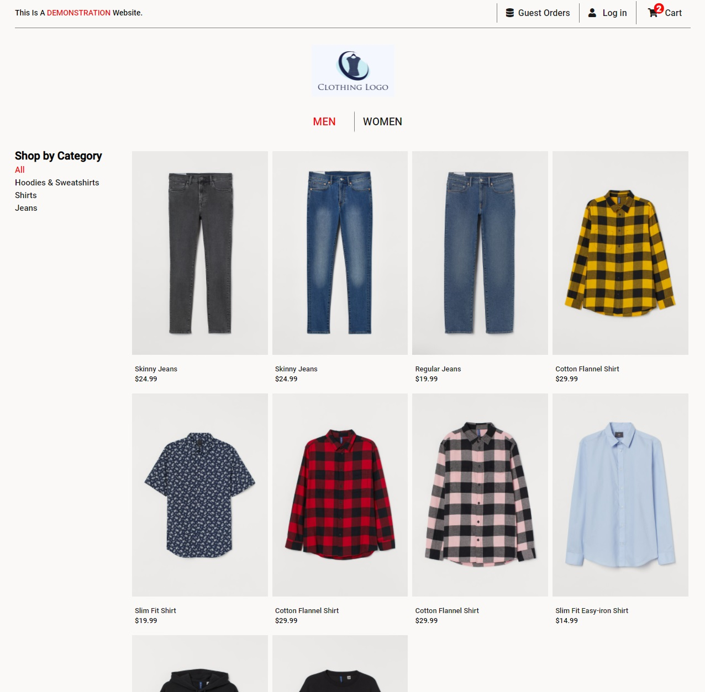
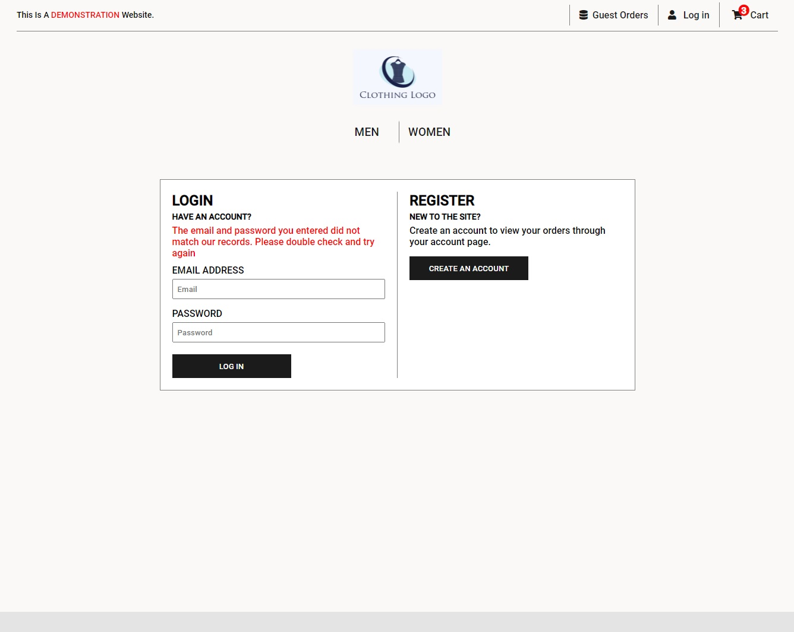

# Clothes store website - In Development

This is a clothing store website where customers are able to browse and purchase clothes. This website was built using the PERN stack.

## Motivation

I decided to start creating a clothing store because I was interested in what goes on behind clothing stores such as uniqlo and h&m both of which inspired the design of the website.

## Code Style

Prettier

## Screen Shots

### Browsing the Catalogue

### Product Page

### Cart Page

### Login Page

### Register Page

## Tech/Framework/Modules/API's

### Frameworks

-React

-Express

### Tech

-Node.js

-Javascript

-HTML5/CSS3

### Modules

**Client**

- Axios
- React-Router-Dom

**Server**

- cors
- dotenv
- helmet
- morgan
- pg
- jsonwebtoken
- bcrypt

**TECH/MODULES very likely to change throughout the creation of this site**

## Features

**Current features:**

-Browse the men's catalogue of clothes

-Navigate to the login/register pages that have client side form validation

-Add clothes into a cart the keeps track of customers purchases and

-View the cart at any time

-Edit the quantity of the item in the cart / or remove item from the cart

**More features are planned and to be added**

Currently working on the user sign in and login with JWT's
